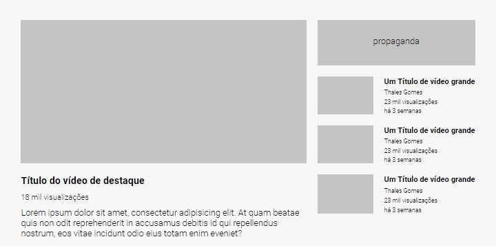

<h1 align="center">Layout Youtube com Grid</h1>
<br>

<p align="center">Meu 1° exercício após completar o módulo de CSS Avançado - GRID </p> 
<br>

<div>
    <h3 align="center"><strong>Resultado</strong><h3>
    <a href="https://thaleshng.github.io/exercicio-layout-youtube-com-grid/" target="_blank"></a> 
</div>

<div align="center">
    
    
    <br>
    
    <br>
    
</div>

<br>


<div aling="center">
    <a href="#tecnologias-utilizadas">Tecnologias Utilizadas</a> •
    <a href="#finalidade-do-projeto">Finalidade do Projeto</a> •
    <a href="#dificuldades-encontradas-e-aprendizados">Dificuldades Encontradas e Aprendizados</a> •
    <a href="#como-ter-acesso-ao-código">Como ter acesso ao Código</a> 
</div>

<br>
<br>

<h2 align="center">Tecnologias Utilizadas</h2>
<br>

[](https://www.devmedia.com.br/o-que-e-o-html5/25820)
<br>
<br>

[](https://kenzie.com.br/blog/css3/)
<br>
<br>
<br>
<br>

<h2 align="center">Finalidade do Projeto</h2>
<br>

<p> O projeto em questão tem como finalidade testar os aprendizados dos módulos de HTML e CSS (Parte 3) do curso de developer que tem enfoque em GRID.</p> 
<p>A premissa do exercício em questão foi fazer um Layout parecido com o do YouTube, usando mais o GRID, porém, podendo usar Flexbox também, para praticar todas as ferramentas ensinadas no curso.</p>
<br>
<br>
<br>
<br>

<h2 align="center">Dificuldades Encontradas e Aprendizados</h2>
<br>

<p> No geral eu consegui atingir os objetivos que se pediam no exercício, contudo, por ser o 1° exercício que usei GRID tive um pouco de dificuldade na estrutura e até mesmo na prática do Clean Code, acredito que usei alguns métodos não tão recomendados.
Utilizando o FIGMA novamente para visualizar os parâmetros do projeto. A plataforma é bem intuitiva e não encontrei muitas dificuldades ao utilizá-la</p>
<p> Observei o código da resolução do exercício e percebi que poderia ter encurtado o código, usando menos elementos HTML, ficando até mais fácil de visualizar e até mesmo dar manutenção caso necessário.
Após o projeto finalizado, comparei o meu código ao código da resolução e destaquei os pontos onde podiam ser melhorados, para que os erros não voltem a acontecer nos próximos exercícios.
<br>
<br>
<br>
<br>

<h2 align="center">Como ter acesso ao Código<h2>
<br>

### Pré-requisitos:
<br>
Antes de começar, vai precisar ter instalado na sua máquina as seguintes ferramentas:
<br>
<br>

[Git Bash](https://git-scm.com)

[VS Code](https://code.visualstudio.com)
<br>
<br>

Clone este repositório com o Git Bash:
```
git clone https://github.com/thaleshng/exercicio-layout-youtube-com-grid.git
```
Entra na pasta que foi criada e abra com o Visual Studio Code.